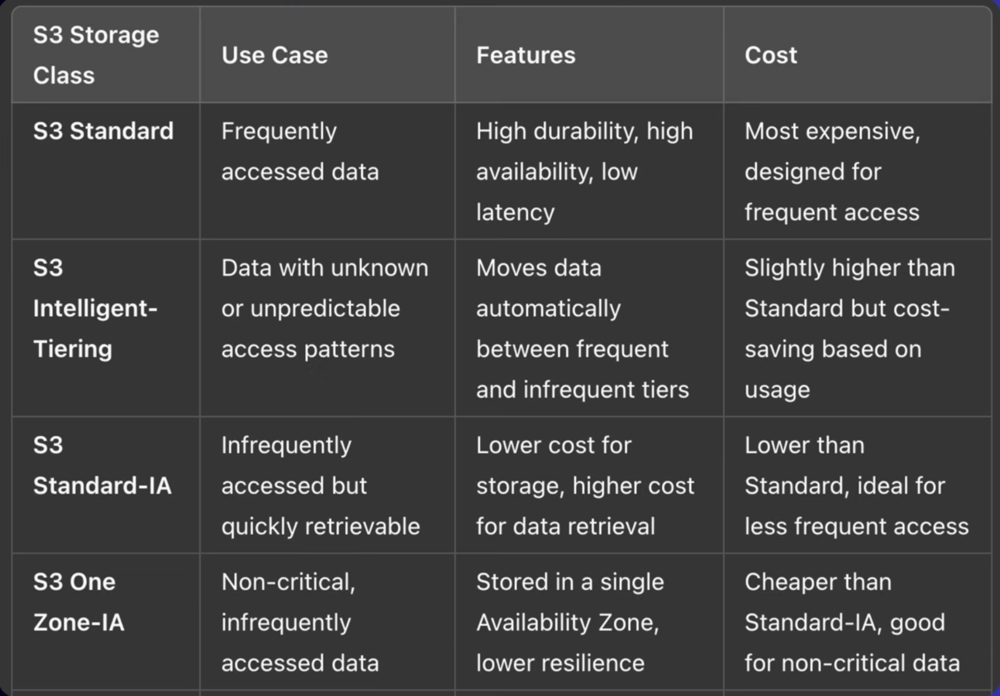
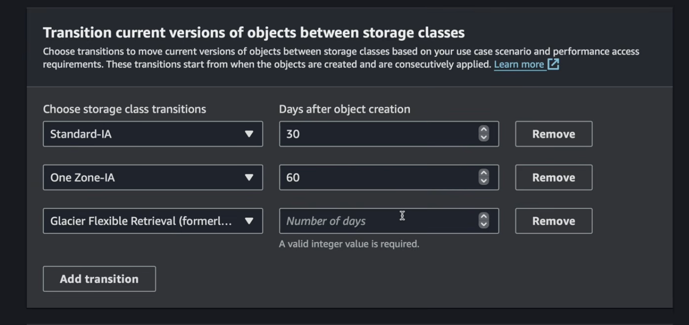
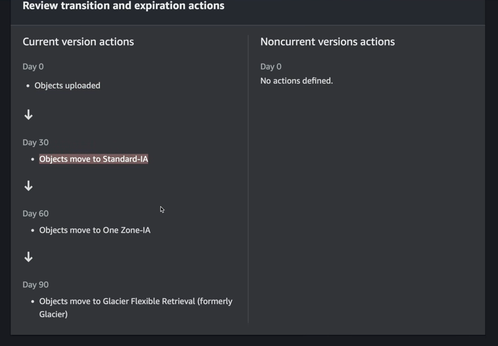
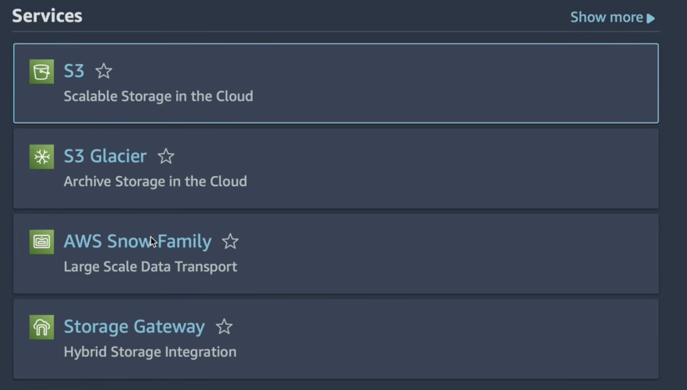
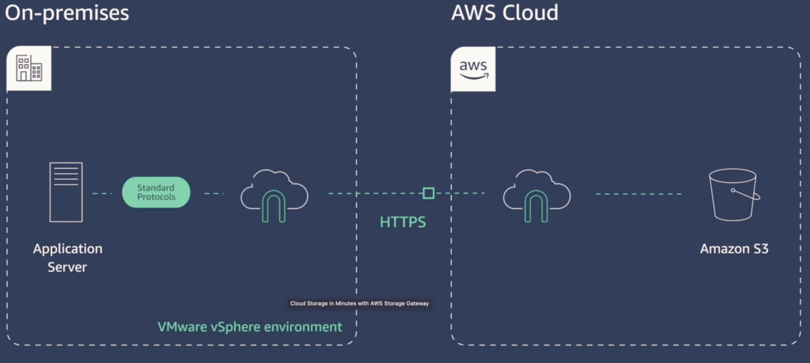
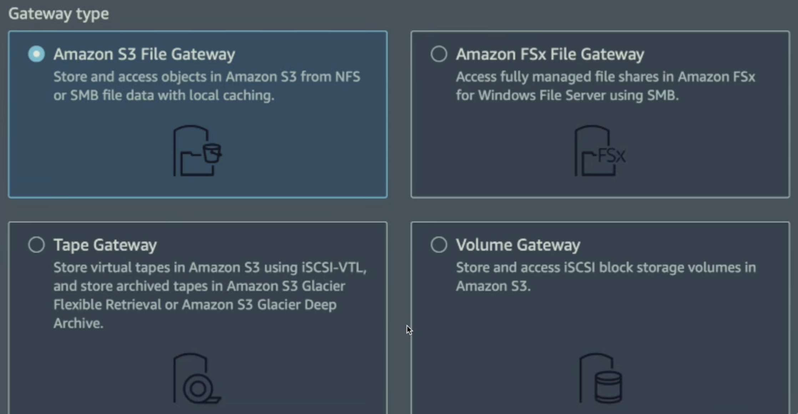

# Amazon S3 Notes & Cheat Sheet

## AWS S3 (Simple Storage Service):-
        is a cloud- based storage service that allows you to store , manage ad retrieve large amounts of data  like files , images , videos and baclups securely and at large scsle.
        It provides  highly reliable , scalable  objects objects storage , making our data accesssible from anywhere , anytime , via the internet. 

        # KEY POINTS OF S3 Bucket :-
             * Store data s obkects 
             * Globalyyy Unique name
             * Region Specifi 
             * Each objects within a bucket is stored as a key-value pair
    
    - key is the object name  ( ehisch can contain slashes / , mimking directory structure ) 
    - value is the content of the object (the file/data itself).
            * Maximum object size :-
             * 5TB os  the maximum size for a single object in Amazon S3 

    Multi part upl  oad is recommended for pbjects larger than 5GB

        In One region data is replicated in all diffeent server .

        WE can also treat our S3 buket as static websit .
         thee is an option in aws where we can configure statitic wesite hosting 
            make it enable , it will work 
            bucket webiste endpoint - you will get this
            in the form of url which you can see .
            at the ame time we have giv ethe all files permission t use as a website  other wise it will give errror   -- acccess denied 

    And also we hav eto giv ethe permisssion of S3 Bucket Policies 
     * whic is JASON - based access control policies that you attach directly to an S3 bucket to msnsge permisssion for accessing the bucket and its objects.

     They allow  us to define who can access the data and what actions they can perform , such as read , write or delete enabling fine-grained control over the security aof our data stored in S3.

## Write or paste your JASON policies in the Bucket policies editor .
        * we can also USE aws policy generator to create a custom polic , or you can manually write the policy in JASON format.

        ---> GetObject :- used to retrieve ir download files from am S3 bucket.
        ---> PutObject :- Used to upload or files into an S3 bucket .

##  S3 Versioning
         whenver you fupload the files there is versioning in the aws

         we can edit this in Edit Bucket Versioning and enable the feature and save the changes.
         because this works only for the all files which is uploaded after the setting changes of versioining . otherwise it will show null inn versioning section.

         so if we change our files design, does anyhting after the  versioning th e we can use it  . use the show versiion then you can see all the version.

    ## S3 Replication 
            S3 Replication
            It allows you to automatically copy objects from one S3 bucket to another, which can be
            • within the same region (Same-Region Replication - SRR) or
            • in different regions (Cross-Region Replication - CRR).
        It's commonly used for compliance, redundancy, and to improve data access performance by maintaining copies closer to your users.

##                           S3 STORAGE CLASS

 ###  The image shows a reference table outlining four AWS Amazon S3 Storage Classes, comparing their typical use cases, features, and cost structures.

##                        S3 Bucket Lifecycle
    You can use lifecycle policies to control the movement of objects between different storage classes or delete them entirely, based on specific conditions like age or inactivity.
    you can see here in photo below

    * Review transtion and expiration actions

 

## S3 SNOW Family

        * The S3 Snow Family is a group of physical devices offered by AWS to help move large amounts of data to the cloud when using the internet isn't practical.
        * These devices are used when there's too much data to upload over a regular connection or when dealing with remote areas without good internet.
                *   Slocome
                *   Snowball
                *   Snowmobile
                *   aws

                
    Aws Snow Family also helps to process data to the edge and migrate data into and out of AWS

    The Snow Family includes:

• AWS Snowcone: A small, portable device for a few terabytes of data.
• AWS Snowball: A larger device for moving petabytes of data and can also be used for edge computing.
• AWS Snowmobile: A massive truck-sized container used for exabyte-scale data transfers, typically used by big companies moving entire data centers.

These devices help you transfer data quickly, securely, and cost-effectively to AWS, especially when internet speed or reliability is an issue.

##            Amazon S3 Storag Gateway 
        It is a hybrid cloud storage service that connects on premises environments to cloud storage in Amazon S3 . It helps extend your local storage to the cloud by acting as a bridge.       
        
         

###  Differents kinds of gateway and use cases 

# CHEETSHEET 

## 1. Core Architecture: Buckets & Objects
Amazon S3 is a highly scalable object storage service (not a block or file system). It utilizes a flat, non-hierarchical architecture.

### Buckets (The Containers)
* **Global Namespace:** Bucket names must be globally unique across all AWS accounts worldwide (like a domain name).
* **Region-Specific:** You choose a specific AWS region when creating a bucket. Data never leaves that region unless you explicitly configure replication.
* **Bucket Limits:** By default, you can create up to 10,000 buckets per account.
* **Naming Rules:** 3–63 characters; lowercase letters, numbers, and hyphens only; no underscores; cannot end in a hyphen or look like an IP address.

### Objects (The Files)
* **Components:** An object consists of a Key (the file path string), Value (the raw bytes), Metadata (key-value pairs like Content-Type), and a Version ID.
* **Size Limits:** Objects can range from 0 bytes up to 5 Terabytes.
* **Multi-part Uploads:** Required for files larger than 5 GB, and highly recommended for any file over 100 MB to improve upload speed and reliability.
* **Virtual Folders:** S3 has no real folders. It simulates them using prefixes in the object key (e.g., `photos/2026/beach.jpg` is just a flat key containing slashes).

---

## 2. S3 Bucket Types
AWS categorizes S3 buckets based on performance and data types:

* **General Purpose Buckets:** The default type for virtually all standard use cases. Offers multi-AZ redundancy and scales infinitely.
* **Directory Buckets:** Built specifically for S3 Express One Zone. Designed for ultra-low, single-digit millisecond latency workloads.
* **Table & Vector Buckets:** Specialized bucket types optimized for tabular structured data (like database query formats) and machine learning vector embedding data.

---

## 3. Key Features to Know
* **Consistency Model:** S3 features strong read-after-write consistency for PUT and DELETE operations of all objects. Once a file is written or deleted, immediate subsequent reads will always reflect that change.
* **Versioning:** Protects against accidental deletion or overwrites by preserving history. Deleting an object creates a "Delete Marker." You can reverse this by deleting the marker.
* **Lifecycle Rules:** Automates cost savings by defining transitions (e.g., Move objects to Glacier after 30 days) or expiration policies (e.g., Delete logs after 90 days).
* **Static Website Hosting:** You can configure an S3 bucket to host a lightweight front-end website directly from a public URL.

---

## 4. Security & Access Control
S3 is private by default. Access can be managed via four mechanisms:

| Security Mechanism | Scope | Common Use Case |
|---|---|---|
| **IAM Policies** | User/Group level | Grants internal AWS users or applications permissions to access specific buckets. |
| **Bucket Policies** | Bucket level | Grants cross-account access, enforces SSL/HTTPS connectivity, or opens public access for static websites. |
| **Access Control Lists (ACLs)** | Object/Bucket level | Legacy method. Mostly disabled by default now in favor of Bucket Policies. |
| **Object Lock (WORM)** | Object level | Write Once, Read Many. Used for regulatory compliance. Comes in Governance mode (privileged users can override) and Compliance mode (even root cannot delete until the retention period expires). |

* **Encryption:** S3 supports Encryption in Transit (via TLS/HTTPS endpoints) and Server-Side Encryption at Rest via SSE-S3 (managed keys), SSE-KMS (custom key management), or SSE-C (customer-provided keys).

---

## 5. S3 Storage Classes Cheat Sheet
To save money, match your data's access patterns to the appropriate storage tier:

| Storage Class | Designed For | Min Storage Duration | Retrieval Fee | AZ Redundancy |
|---|---|---|---|---|
| **S3 Standard** | Frequent access, active data. | None | None | ≥ 3 AZs |
| **S3 Intelligent-Tiering** | Unknown or shifting access patterns. Automatically moves files to save money. | None | None | ≥ 3 AZs |
| **S3 Standard-IA** | Infrequent access but needs millisecond availability (e.g., backups). | 30 days | Per GB retrieved | ≥ 3 AZs |
| **S3 One Zone-IA** | Infrequent access, non-critical data that can be re-created if a data center destroys. | 30 days | Per GB retrieved | 1 AZ |
| **S3 Glacier Instant Retrieval** | Archive data accessed a few times a year but needed in milliseconds. | 90 days | Per GB retrieved | ≥ 3 AZs |
| **S3 Glacier Flexible Retrieval** | Archive data. Retrieval times range from 1–5 mins (Expedited) to 3–5 hours (Standard). | 90 days | Per GB retrieved | ≥ 3 AZs |
| **S3 Glacier Deep Archive** | Long-term retention (years). Lowest cost, retrieval takes 12–48 hours. | 180 days | Per GB retrieved | ≥ 3 AZs |
