Wht is VPC?
      A private isolated network within the AWS cloud where we can launch and manage our resources  securely.
                VPC --- Virtual private Cloud .

Why we need  VPC?
        To securely isolate and control network environment. we get additional layer of sefety using VPC . 

    What happens when we create VPC?
        When we create VPC , we specify a CIDR block that defines the IP address range for the entire VPC,
            for ex- 10.0.0.0/16 - this blocks allows for 65536  Ip addresses (built in reality , 65531 usable addresses )
                    CIDR (class inter domain routing ) is a method for allocating IP addresses and routing Internet protocol (IP ) packets

    CIDR Block allocatiom 
         we can specify a range of IP (10.0.0.0/16 - 65536 ) addresses (CIDR block) within the VPC's IP addresses range for the subnet
                 THIS determines the pool if IP addresses available for instances in the subnet. 

                 the range should be under the VPC.
                        
                        
                        ## To understand this better go to website cidr.xyz  , i is an interacting website.
                                there is default VPC whic provided and manged by aws through which  we perform or all task.

What is Subnet?
    A subnet is a smaller , segmented part of a larger network that isolates and organize devices within a speecific Ip adress range.   
                    VPC 100 IPs
                        |
                 |               | 
    public-subnets 50 IPs         private-subnets. 50 IPs
    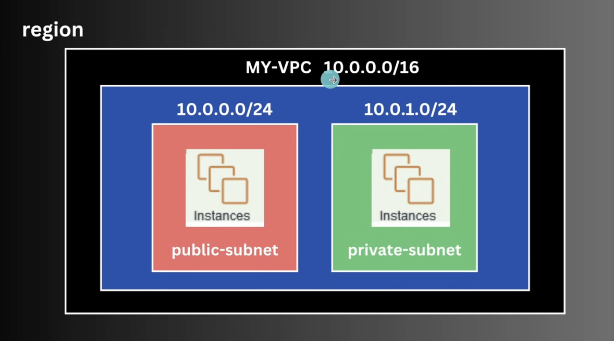

    ## Note:- WE CANNOT USE VPC DIRECT . so we have to use subnet so CIDR 
    Inside the network we create RESOURCE (ex-EC2 instance )

        EC2 instance is created under the subnet
        as shown in the figure

        Look inn the photo as we public subnet .
            the range we are providing of the subnet will be the same ip asssigned . you can try in aws vpc

            NOTE:- WE CAN ASSIGN MULTIPLE SUBNET , EVEN WE CAN CHANGE THE THE NAME OF OUR SUBNETS

            Why more subnet --- because we in our website which is accessible to public directly and may our main data in private . that's why

              FOR EX--- we put our frontend in public and data (database)in private so user or client doesnt have the access of data directly.
    
          NOTE 

    #@$  WE CAN CREATE MULTIPLE INSTANCE IN ONE SUBNET , as shown in the figure below. 
    THERE ARE MULTIPLE CASES ,--- WE CAN CREATE MULTIPLE INSTANCES OR WE CAN CREATE MULTIOLW INSTANCE IN MULRIPLE OF AVAILABILITY ZONE . BLOW IN FIGIRE . This decision is in maker or owner .

    whatever we crreate the resource 

WE DEPLOY OR WEBITE IN SAME REGION IN MULTIPLE SERVER ,  if crash happens in one server , so the website should still perform from other server as backup . or for load . we cann learn hee more about loadblancer . more details

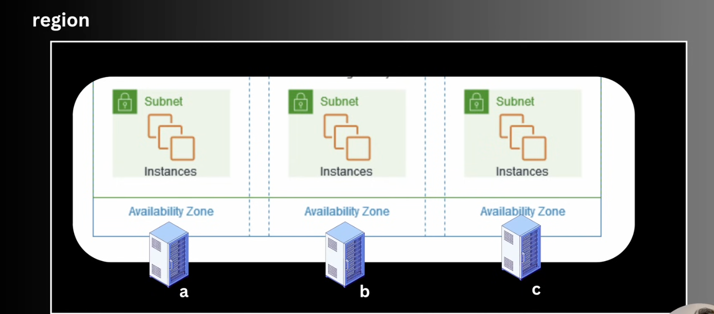

    ![Region diagram showing three subnet columns labeled Subnet and Instances, arranged across a large rounded rectangle representing a region. Each subnet is placed in a separate Availability Zone, labeled a, b, and c, with a server stack beneath each zone. The diagram illustrates multiple EC2 instances spread across availability zones for redundancy, high availability, and load distribution. The wider environment is a clean, technical AWS architecture illustration on a light gray background with blue dashed lines separating the zones. Text in the image includes Region, Subnet, Instances, Availability Zone, a, b, and c. The tone is neutral and informative.](image-1.png)

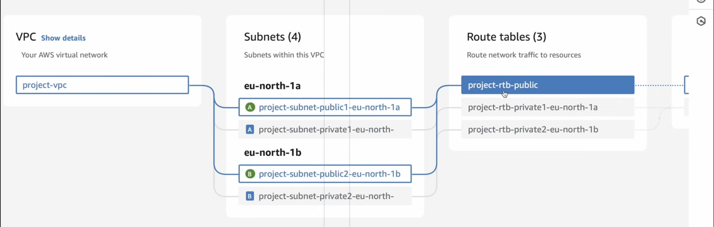

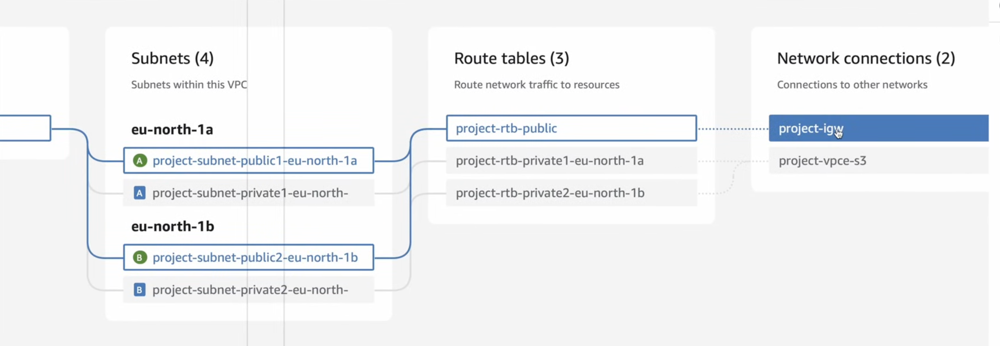

 ROUTUNG TABLE 
    A route table is a set of rules , called routes , that are used to determine where network traffic from our subnets or gateway is directed . each subnet in our VPC must be associated wit a route table  , whic controls the routing for that subnet.

    VPC ---> Subnet------> Routetable ------> Internet gateway 

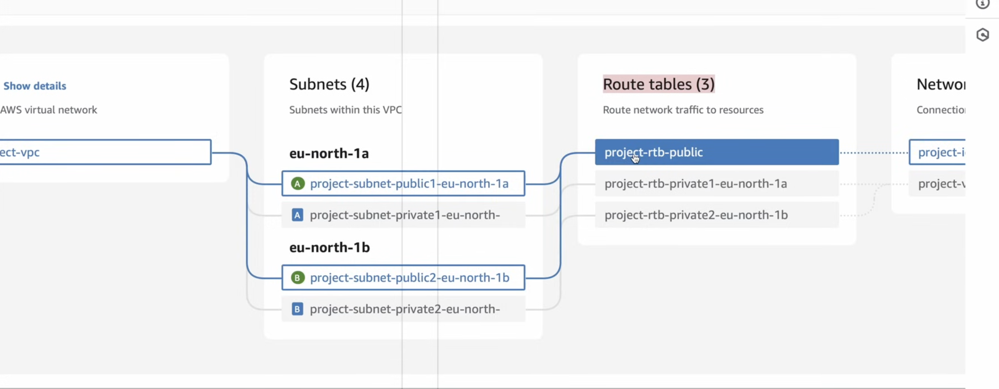
 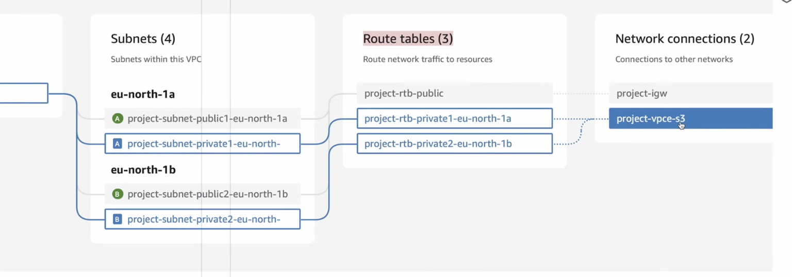 
     how and from where to where is data is sent . look closely booth photos .

there is default VPC whic provided and manged by aws through which  we perform or all task.

  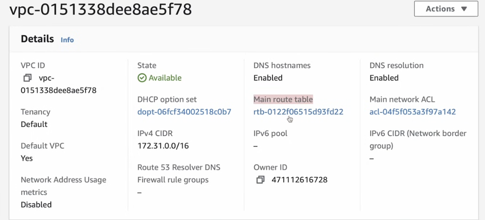

     INTERNET GATEWAY 

            An internet Gateway is a compaonent  that allows  communication between instances in in your VPC ans the  interenet (world).

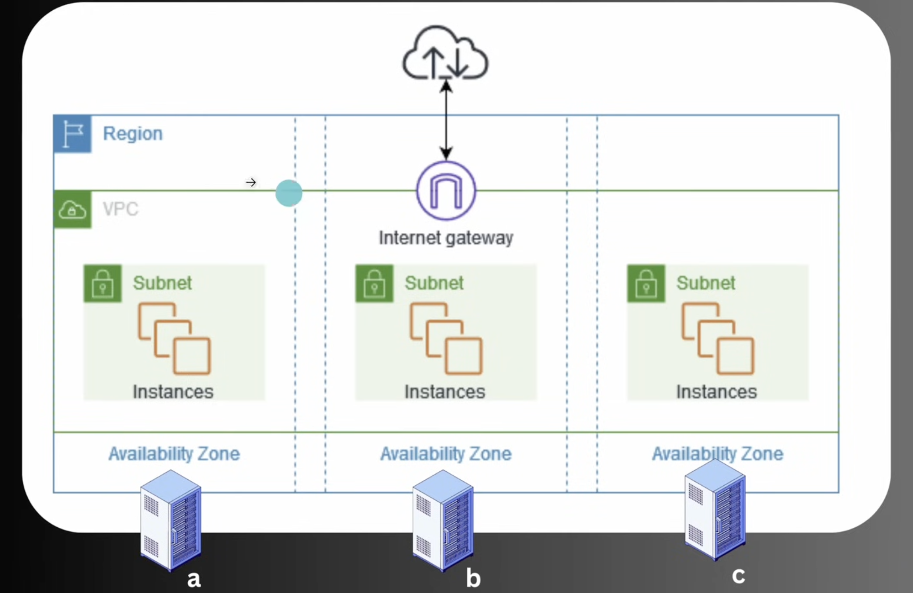

            Security Rules :- Network firewall rukes that  control inbound traffoc for instances.

            which data should flow in and out is defined by rules of security groups

    NOTE :- THis is a  firewall but it is a instances speific .
    for ex we can make diffrent diffrent security groups for diffrent Instances (EC2)

    or we wcan make one group and we share too 

    Internet gateway is attached to VPC

    Network ACLs (Access control Lists):
          it works on subnet level

    Optional layer of security four our VPC that acts as firewall for cintrilling trraffic in and out of one or more subnets
   allow or dent rule.
     NOte :- in Security Groups we can only inbound and outbound means only Alloe . but in ACLs we and deny and allow both .

     NAT (Network address translation ) Gateway :- Enables 

     
     instances in private subnet to connect to the internet or other AWS services , but orevents the internet from initiating connections to thise instances.

     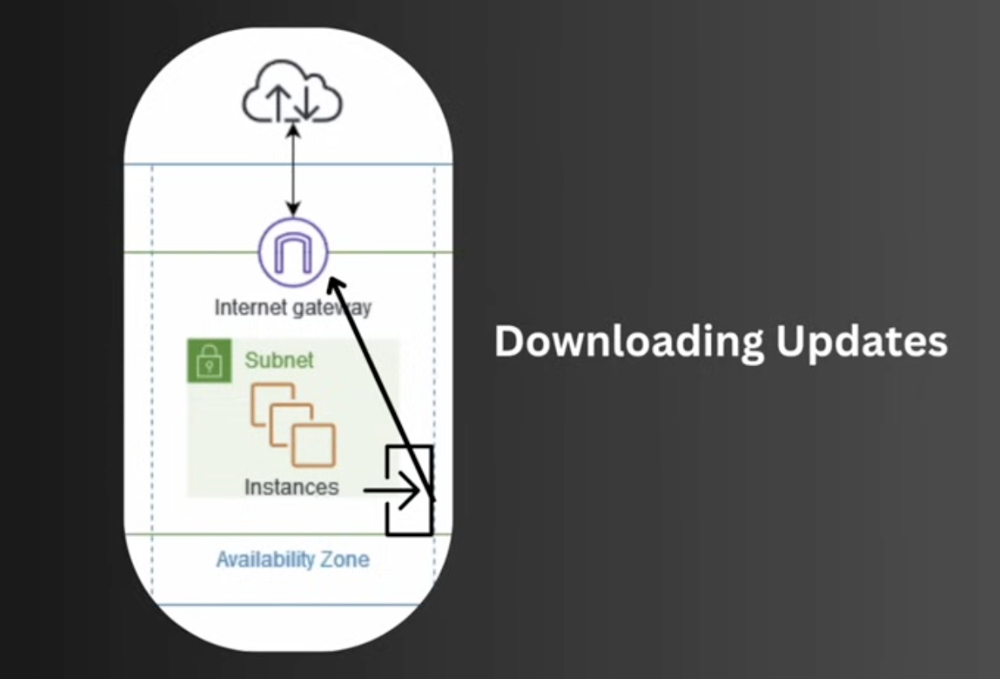

    ex- we made aprivate instance which is connected to databse 
        and the database doesnt need the connection from the internet 
        and we have to update our database  the aws has to download the files 
        . means we request traffic from inside the instance but not from the  outside  (dataleak) . one way communication
        so we use NAT 

        NAT can be used in public and private.

        

             VPC PEERING:
    A networking connection between two VPC that enables you to route traffic  between them privately.
           
           if we have to coonec to vpc or more on doffrent region or samaae region or we have to enble/setup vpc in diffrent region 

           how we can syn the two vpc to get better result 
           so we use VPC peering 

    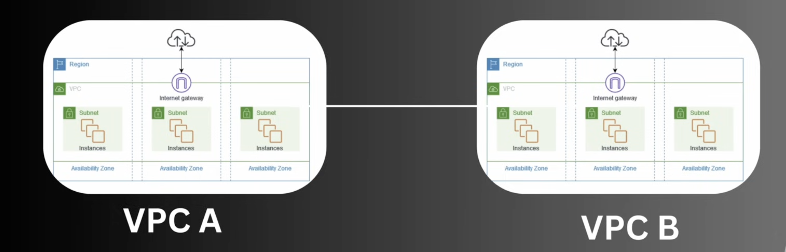

VPC endpoints :- Allows you to privately  connect your VPC to suppported AWS serviices and VPC endpoints services powered by AWS Private link

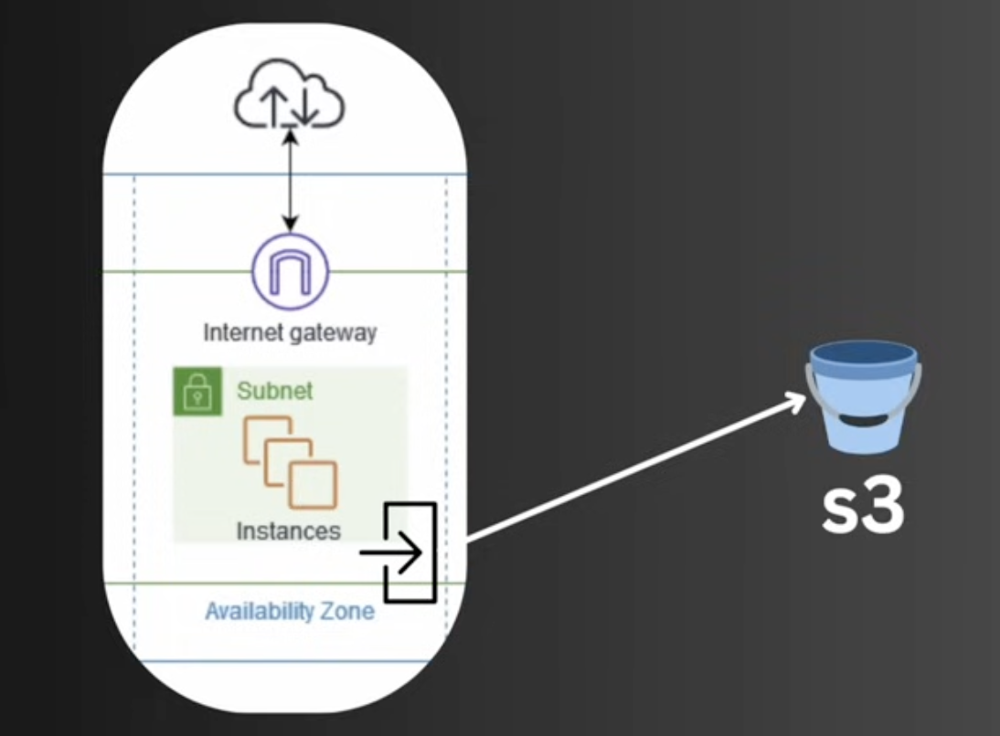

Bation Hosts :-  A special-purpose instances that provides      secure acces to your innstances inn private subnets.
like jump server

 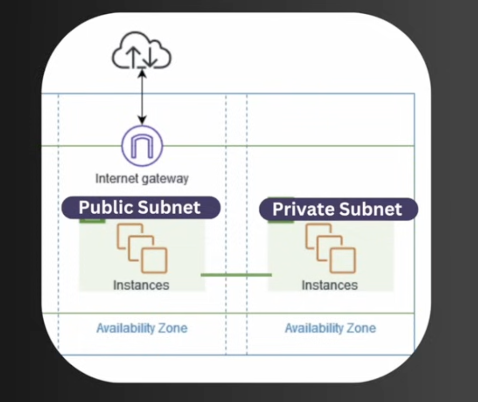

     ELASTIC IP ADDRESSES : -
            Static IP address designed for dynamic compunting.

            whever we start or stop or instances , always a new IP is genrated 
            and or instance is connected to other instance or devices and other devices are reliable on other instances ip . If the IP keeps changing then how will the other devices get connected . so we need here static IP . that why we use ELASTIC IP ADDRESSESS.

VPC Flow Logs: Capture information about the IP traffic  going to and from network interfaces in our VPC.

                      DIRECT CONNECˇ:-----

 Establishing a dedicated network connection from our premises to AWS 

         lots of orgainzation are relying on cloud platforms
         so we have to remotely acces and work 
         we have to connect and in security point of view , we cannot make it public to expose on the internet.

         So here we establish a DIRECT CONNECT to get the connection privately , specially used in offices .

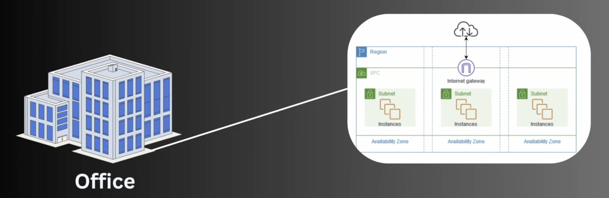

         AWS client VPN:
          Managed VPN service that enables remote access to AWS resources and on -premises networks using OpenVPN-based clients.